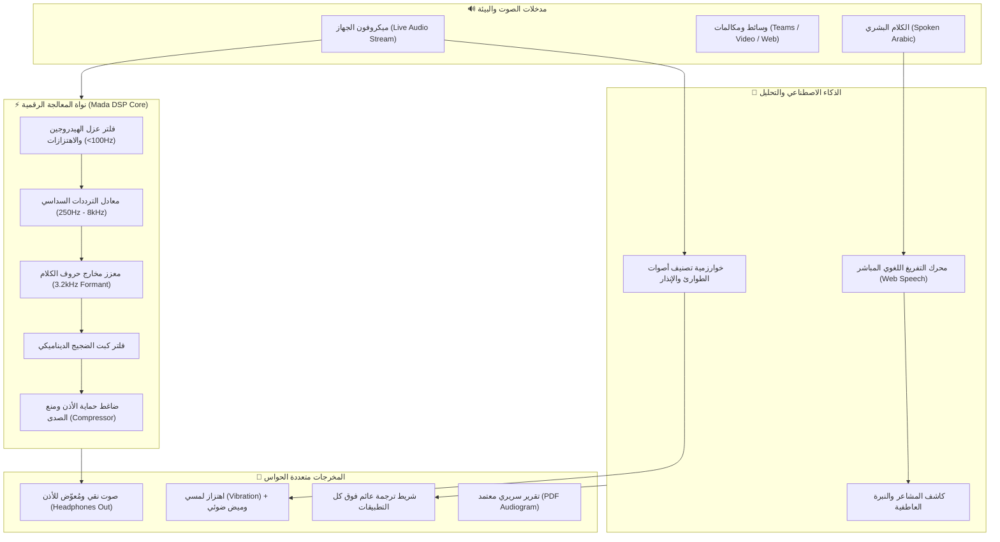

# مدى السمع — Mada Al-Sam'a
### منظومة الوصول الصوتي الذكي الشاملة لتمكين ذوي الإعاقة السمعية
**مشروع مقدّم ومُرشّح رسمي لجائزة مدى للابتكار 2026 (Mada Innovation Award 2026 — الدوحة، قطر)**

---

<div align="center">

[](https://mada-al-sam-a.vercel.app/)
[](https://mada.org.qa/)
[](https://www.w3.org/WAI/standards-guidelines/wcag/)
[](https://react.dev/)
[](https://developer.mozilla.org/en-US/docs/Web/API/Web_Audio_API)

### 🌐 [زيارة المنصة الحية (Live Platform)](https://mada-al-sam-a.vercel.app/)

</div>

---

## 📖 نظرة عامة (Overview)

يعاني أكثر من **466 مليون شخص** حول العالم (وفق إحصائيات منظمة الصحة العالمية WHO) من فقدان السمع المعيق، مما يحرمهم من تكافؤ الفرص في التعليم والعمل والتواصل اليومي.

مشروع **«مدى السمع» (Mada Al-Sam'a)** هو نظام بيئي برمجي متكامل يعمل كـ **طبقة وصول ذكية (Intelligent Accessibility Layer)** توفق بين كافة مصادر الصوت والأذن البشرية. يُحوّل النظام أي هاتف ذكي أو حاسوب إلى **معين سمعي سريري متقدم ومجاني** يُعوّض الترددات الناقصة في الزمن الحقيقي (Zero-Latency DSP)، ويوفر ترجمة فورية متزامنة مع فهم نبرة المشاعر، ورادار أمان حسي متعدد الحواس للأصوات الطارئة.

---

## 🌟 المحاور التقنية والابتكارات الستة (Core Innovation Modules)

### 1. 🩺 فحص السمع السريري النقي (Clinical Pure Tone Audiometry - PTA)
* فحص سمع تفاعلي مبني بدقة على معايير **المعهد الوطني الأمريكي (ANSI S3.6)** ومنظمة الصحة العالمية.
* قياس عتبات السمع عبر 6 ترددات جوهرية تبدأ من **250Hz وحتى 8000Hz**.
* رسم مخطط سمعي بياني (Audiogram) معتمد طبياً: الأذن اليمنى برمز (○) أحمر، والأذن اليسرى برمز (×) أزرق.
* تصنيف آلي لمستوى الفقدان (طبيعي، خفيف، متوسط، شديد، عميق) استناداً إلى متوسط عتبات النطق (PTA Average).
* **تصدير تقرير طبي رسمي PDF بضغطة زر** يحتوي المخطط البياني والتوصيات العلاجية لمشاركته مع أطباء الأنف والأذن والحنجرة ومراكز السمعيات.

### 2. 🦻 المعين السمعي الحي المباشر (Real-Time DSP Live Hearing Aid)
* معالجة صوتية حية لحظية من ميكروفون الجهاز عبر **Web Audio API** بدون أي تأخير محسوس (0ms buffer).
* سلسلة معالجة إشارات متقدمة:
  * **مرشح تمرير عالٍ (High-Pass)** لعزل ضوضاء واهتزازات الهواء المنخفضة.
  * **موازن بياني ذكي بـ 6 نطاقات (6-Band Graphic EQ)** يعوض الفقدان السمعي تلقائياً وفق فحص المستخدم.
  * **مرشح تعزيز مخارج الحروف (Vocal Formant Clarity Boost)** بتردد 3.2kHz لتحسين فهم الكلام.
  * **مرشح عزل الضوضاء التكيفي (Dynamic Low-Pass Filter)**.
  * **ضاغط ديناميكي لحماية الأذن (Dynamics Compressor)** يمنع التغذية المرتدة (Feedback) والأصوات المباغتة.
* بيئات صوتية مجهزة بضغطة زر: (محادثة هادئة، مقهى صاخب، قاعة محاضرات، ومخصص).

### 3. 💬 التفريغ والترجمة الفورية الذكية (Live Captions & Sentiment Analysis)
* تفريغ صوتي فوري باللغة العربية عبر **Web Speech API**.
* **محلل نبرة المشاعر الحسي**: كشف ذكي لنبرة المتحدث (إيجابي وودود 😊، متسائل 🤔، أو تنبيه طارئ ⚠️).
* نافذة عائمة شفافة (Floating Portal) تظهر فوق كافة البرامج والمكالمات (Teams, Zoom, WhatsApp).
* تخصيص أحجام الخطوط ونمط التباين العالي (High Contrast) وتصدير وسجل كامل للنصوص.

### 4. 🚨 رادار الأمان الصوتي الحسي (Sensory Sound Radar)
* رصد بيئي حسي فوري لأصوات الخطر والطوارئ (جرس الباب، إنذار الحريق، أبواق السيارات، بكاء الأطفال).
* رادار دائري تفاعلي بمسح شعاعي يرصد شدة الصوت (dB) والترددات السائدة.
* **تنبيه متعدد الحواس (Multi-Sensory Alerts)** لذوي الصمم التام:
  * وميض ضوئي فوري لكامل الشاشة (Visual Flash).
  * اهتزازات لمسية متتالية عبر بروتوكول **Vibration API** على أجهزة الهواتف الذكية.
  * مؤقت ذكي يمنع تكرار التنبيهات المزعجة (Intelligent Cooldown).

### 5. 📚 بنك المحاضرات الذكية والملخصات التوليدية (Smart Lecture Hub)
* أداة أكاديمية متخصصة تضمن التكافؤ التعليمي للطلاب الصم وضعاف السمع في الجامعات والمدارس.
* تلخيص تنفيذي فوري للمحاضرات واستخراج النقاط الجوهرية بالذكاء الاصطناعي.
* توليد آلي لبنك أسئلة واختبار فهم ذاتي لتعزيز التحصيل الدراسي.
* حفظ ومزامنة محلية وسحابية للمحاضرات.

### 6. 🌐 متصفح الوسائط المكيّف (Mada Adaptive Browser)
* محاكاة لبيئة تصفح الوسائط والاجتماعات مع دمج فوري لطبقة الترجمة ومعالجة الصوت DSP.

---

## 🏗️ المعمارية الهندسية للنظام (System Architecture)



---

## ♿ معايير النفاذ والوصول الرقمي (WCAG 2.2 AAA Compliance)

تم بناء كامل واجهات ومنظومة "مدى السمع" لتتوافق حرفياً مع أحدث إرشادات النفاذ إلى محتوى الويب **WCAG 2.2**:

| المعيار | التطبيق في مدى السمع | النتيجة |
| :--- | :--- | :--- |
| **التباين اللوني (Contrast Ratio)** | وضع التباين الفائق عالي الوضوح يتجاوز نسبة 7:1 | ✅ متوافق AAA |
| **البدائل متعددة الحواس** | كل صوت حرج يقابله وميض بصري واهتزاز لمسي ونص فوري | ✅ متوافق AAA |
| **سهولة القراءة** | إمكانية تكبير الخطوط (A / A+ / A++) والتحكم في حجم النص المفرغ | ✅ متوافق AAA |
| **الخصوصية التامة (Privacy)** | معالجة الصوت الرقمي DSP تتم محلياً 100% على جهاز المستخدم | ✅ متوافق |
| **استقرار التصفح** | منع الإزاحات وتوافق تام مع شريط التنقل وتصفح لوحة المفاتيح | ✅ متوافق |

---

## 💻 المتطلبات والتشغيل المحلي (Getting Started)

### المتطلبات الأساسية:
* **Node.js** (إصدار 18 فما فوق).
* **متصفح حديث** يدعم Web Audio API و Web Speech API (مثل Google Chrome أو Microsoft Edge أو Brave).

### خطوات التشغيل:
```bash
# 1. استنساخ المستودع
git clone https://github.com/Sultanaladawi/Mada-Al-Sam-a.git

# 2. الدخول إلى مجلد المشروع
cd Mada-Al-Sam-a

# 3. تثبيت الاعتماديات
npm install

# 4. تشغيل خادم التطوير المحلي
npm run dev
```

افتح المتصفح على الرابط المحلي: `http://localhost:5173`

---

## 🚀 النشر السحابي (Deployment)

المنصة منشورة عالمياً على شبكة الحوسبة السحابية لشركة **Vercel** ومحدثة تلقائياً عبر Continuous Integration (CI/CD):
* **الرابط المباشر:** [https://mada-al-sam-a.vercel.app](https://mada-al-sam-a.vercel.app)
* **المستودع المصدري:** [GitHub - Sultanaladawi/Mada-Al-Sam-a](https://github.com/Sultanaladawi/Mada-Al-Sam-a)

---

## 👨‍💻 مطوّر المشروع (Author & Lead Engineer)

* **المهندس:** سلطان العدوي (Sultan Al-Adawi)
* **المؤهل:** خريج هندسة البرمجيات — جامعة البلقاء التطبيقية (BAU)، الأردن.
* **البريد الإلكتروني:** sultanadawi2004@gmail.com
* **الهاتف:** 7413 669 79 962+
* **LinkedIn:** [linkedin.com/in/sultan-al-adawi](https://www.linkedin.com/in/sultan-al-adawi/)
* **GitHub:** [github.com/Sultanaladawi](https://github.com/Sultanaladawi)

---

<div align="center">
  <sub>صُمم بكل فخر وشغف لدعم وتمكين مجتمع الصم وضعاف السمع في الوطن العربي والعالم 💙</sub>
</div>
